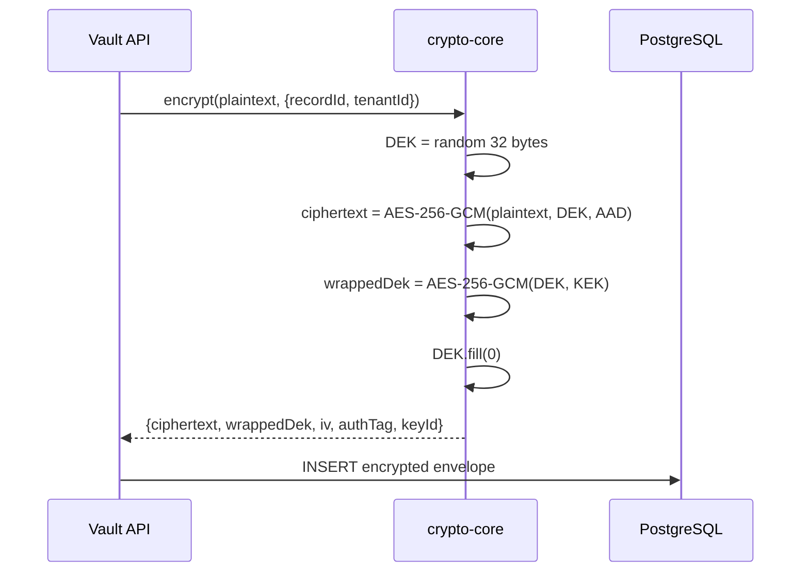
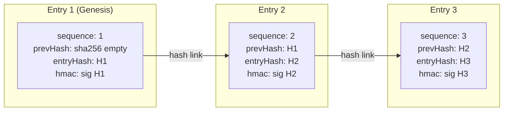

# Secure Data Vault


Production-grade reference architecture for storing regulated data (PHI, PII, financial records) with application-layer envelope encryption, tamper-evident audit trails, and type-safe validation.

Built with **NestJS 11**, **Angular 21**, **Drizzle ORM**, and **PostgreSQL 16**.

---

## Why This Exists

Storing sensitive data isn't just about encryption at rest. Production systems need:

- **Envelope encryption** — so a database breach doesn't yield plaintext
- **Cryptographic binding** — so ciphertext can't be transplanted between tenants
- **Tamper-evident audit** — so you can prove the log hasn't been altered
- **Defense in depth** — validation, rate limiting, PII-safe logging, structured errors

This project implements all of these patterns with zero external crypto dependencies — just Node.js built-in `crypto`.

---

## Architecture

```
┌──────────────┐     HTTPS      ┌──────────────────────────────────────────────┐
│ Admin Console │ ──────────── → │               Vault API (NestJS 11)          │
│ Angular 21    │                │                                              │
└──────────────┘                │  ┌────────────┐  ┌───────────┐  ┌─────────┐ │
                                │  │ crypto-core│  │audit-core │  │ Drizzle │ │
                                │  │ AES-256-GCM│  │hash-chain │  │  ORM    │ │
                                │  └─────┬──────┘  └─────┬─────┘  └────┬────┘ │
                                └────────┼───────────────┼──────────────┼──────┘
                                         │               │              │
                                    ┌────▼────┐          │         ┌────▼──────┐
                                    │Cloud KMS│          │         │PostgreSQL │
                                    │ (prod)  │          └────────►│   16      │
                                    └─────────┘                    └───────────┘
```

## Envelope Encryption

Every record payload is encrypted with a unique Data Encryption Key (DEK), which is itself wrapped with a Key Encryption Key (KEK). The AAD (Additional Authenticated Data) binds each ciphertext to its `recordId:tenantId`, preventing transplant attacks.



**Key properties:**

- DEK is generated fresh per record (never reused)
- DEK is zeroed from memory after use
- AAD = `recordId:tenantId` — decrypt with wrong IDs fails with `AadMismatchError`
- Key rotation: old ciphertexts remain decryptable via `keyId` lookup

## Hash-Chained Audit Log

Every mutating operation (create, update, delete) produces an audit entry linked to the previous entry via SHA-256 hash chain, signed with HMAC-SHA-256.



**Tamper detection covers:**

- Modified fields (action, actor, timestamp, metadata)
- Deleted rows (sequence gap detection)
- Inserted rows (prevHash mismatch)
- Reordered entries (sequence + hash linkage)

Verification: `GET /api/v1/audit/verify` walks the chain and reports `full` (intact) or `failed` with the break point.

## Threat Model

| Threat                                | Mitigation                                               |
| ------------------------------------- | -------------------------------------------------------- |
| DB breach → plaintext exposure        | AES-256-GCM envelope encryption                          |
| Ciphertext transplant between tenants | AAD binds `recordId:tenantId`                            |
| Audit log tampering                   | SHA-256 hash chain + HMAC signatures                     |
| Audit row deletion                    | Sequence gap detection                                   |
| Key material in logs                  | `safeLog()` PII/secret redaction                         |
| Decrypted payload in logs             | Architectural rule: decrypt returns to controller only   |
| DEK in memory after use               | `dek.fill(0)` in finally block                           |
| Timing attack on HMAC                 | `crypto.timingSafeEqual()`                               |
| Concurrent write conflicts            | Optimistic concurrency (version column, 409 on mismatch) |

Full threat model: [`.context/threat-model.md`](.context/threat-model.md)

---

## Quick Start

### Prerequisites

- Node.js 24+
- Yarn (corepack enabled)
- Docker & Docker Compose

### Option A: Full Docker (simplest)

Starts Postgres, vault-api (with auto-migration), and admin-console (nginx) in containers.

```bash
docker compose up -d
```

- **UI:** http://localhost:4200
- **API:** http://localhost:3000/api/v1/health

The vault-api container automatically runs `drizzle-kit push` on startup to sync the database schema.

### Option B: Local dev with hot reload

Runs the API and Angular dev server natively for fast iteration, with Postgres in Docker.

```bash
corepack enable
yarn install
yarn dev
```

- **UI:** http://localhost:4200 (Angular dev server, proxies `/api` to :3000)
- **API:** http://localhost:3000 (NestJS with `--watch`)

### Example Workflow

```bash
# Create a tenant
curl -X POST http://localhost:3000/api/v1/tenants \
  -H 'Content-Type: application/json' \
  -d '{"name": "Acme Health"}'

# Create a user
curl -X POST http://localhost:3000/api/v1/users \
  -H 'Content-Type: application/json' \
  -d '{"tenantId": "<tenant-id>", "email": "admin@acme.health", "role": "admin"}'

# Store an encrypted record
curl -X POST http://localhost:3000/api/v1/records \
  -H 'Content-Type: application/json' \
  -d '{"tenantId": "<tenant-id>", "userId": "<user-id>", "payload": {"ssn": "123-45-6789", "diagnosis": "healthy"}}'

# Read it back (decrypted)
curl http://localhost:3000/api/v1/records/<record-id>

# Verify audit chain integrity
curl http://localhost:3000/api/v1/audit/verify
```

---

## Project Structure

```
secure-data-vault/
├── packages/
│   ├── shared-types/        # Zod schemas (zero deps)
│   ├── crypto-core/         # AES-256-GCM envelope encryption (zero deps)
│   └── audit-core/          # Hash-chained audit log (zero deps)
├── apps/
│   ├── vault-api/           # NestJS 11 REST API
│   └── admin-console/       # Angular 21 SPA
├── infra/                   # Terraform (GCP: KMS, Cloud SQL, IAM)
├── .github/workflows/       # CI, security scanning, E2E, release
├── .context/                # Architecture docs, threat model, ADRs
└── .agents/                 # Agent definitions for AI-assisted dev
```

## GCP Deployment

The `infra/` directory contains Terraform configurations for production deployment:

- **Cloud KMS** — HSM-backed key ring with separate encryption and MAC keys (90-day auto-rotation)
- **Cloud SQL** — PostgreSQL 16 with point-in-time recovery, private networking
- **IAM** — Least-privilege service account: `encrypterDecrypter` for DEK key, `signerVerifier` for MAC key
- **Cloud Logging** — Structured logs sink to BigQuery (365-day retention)

```bash
cd infra
terraform init
terraform plan -var="project_id=your-gcp-project"
terraform apply
```

The vault-api's `keyset-loader.ts` automatically switches from file-based dev keysets to Cloud KMS when `NODE_ENV=production`.

---

## Security Notes

- **Dev keysets are for development only.** They contain plaintext key material and are named `INSECURE-DEV-ONLY` intentionally. Production deployments must use Cloud KMS.
- **The audit log table is append-only by design.** Never run UPDATE or DELETE on `audit_log` — it will break chain verification.
- **Decrypted payloads must never be logged.** The `safeLog()` utility redacts sensitive keys, but the architectural rule is that plaintext only exists between `decrypt()` return and controller response serialization.
- **AAD binding is not optional.** Every encrypt/decrypt call requires `recordId` and `tenantId`. This prevents ciphertext from being moved between records or tenants.

---

## Testing

```bash
# All unit tests (crypto-core, audit-core, vault-api)
yarn test

# E2E tests (requires running PostgreSQL)
yarn --cwd apps/vault-api test:e2e

# Type checking
yarn typecheck

# Linting
yarn lint
```

**Test coverage highlights:**

- 14 crypto-core tests: round-trip, AAD binding, key rotation, Unicode, large payloads
- 14 audit-core tests: chain verification, tamper detection, property-based fuzzing
- E2E tests: encrypted record lifecycle, optimistic concurrency, audit verification

---

## License

MIT
